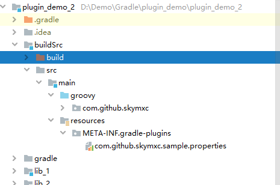
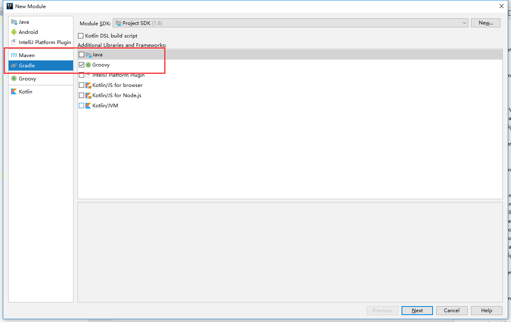
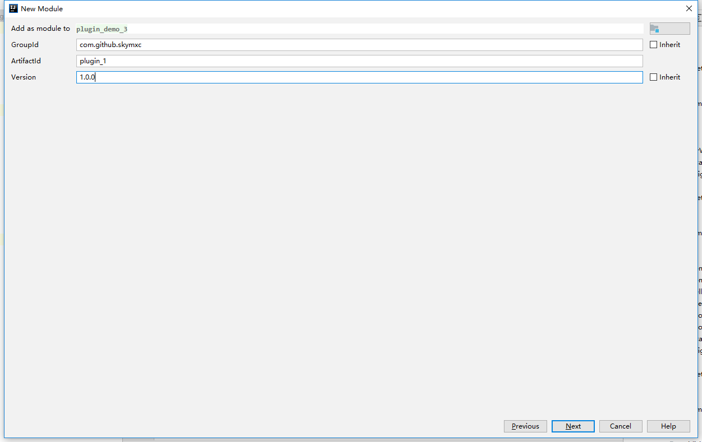
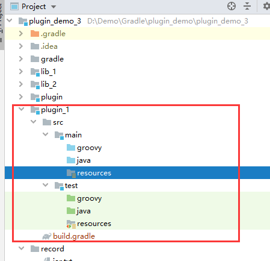
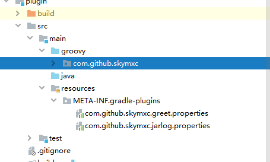
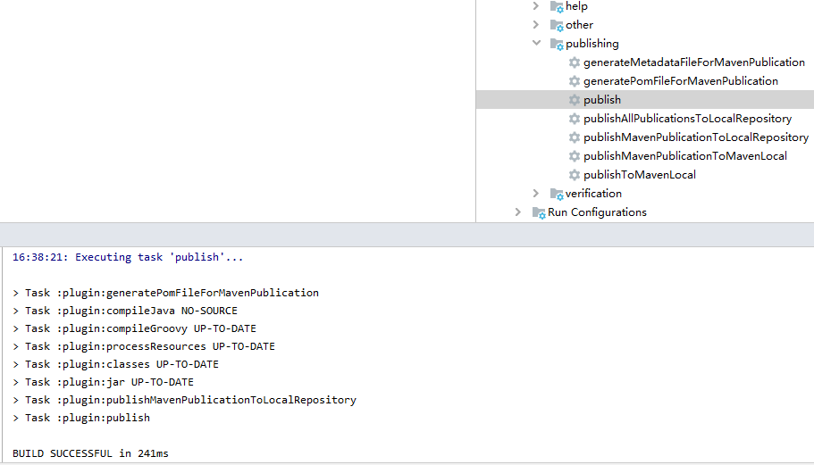
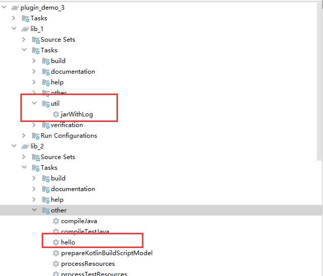
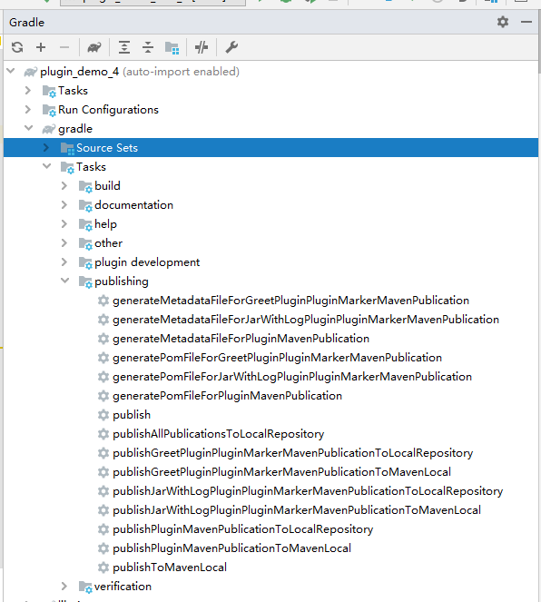

## 目录导航
- plugin_demo_1 脚本里插件
- plugin_demo_2 buildSrc 目录下定义插件
- plugin_demo_3 单独项目定义插件 使用 Groovy 
- plugin_demo_4 单独项目定义插件 使用 Java 配合 DSL


# 自定义插件

> 使用版本 5.6.2

插件被用来封装构建逻辑和一些通用配置。将可重复使用的构建逻辑和默认约定封装到插件里，以便于其他项目使用。


你可以使用你喜欢的语言开发插件，但是最终是要编译成字节码在 JVM 运行的。


Gradle 有两种插件，脚本插件和二进制插件。

关于插件的介绍，可以参考我的另一篇文章 [Gradle 插件](https://mp.weixin.qq.com/s?__biz=MzA5NDkwNjc4Ng==&tempkey=MTAzMl8xSDhSVUUvc211SmpQckJrSmNQZGVZSjJncTdSSmN2eTVUWWFMbThkejVxV1p6ZGxhdW9ya1VleTFmWEpxMjJCZzFaOVRFeU1rRmR5MHg3QTM3UnFwQTAxZEZOVEtDUkEwSDFaZWVHLVNXWW5ZdW1ENzFoVGxSZWxPZm53ZHg0aGo1cmQ0RWJsS1dxQVRFck9HSktLTEVpNHRRNkZSLWtaVVhVbE5nfn4%3D&chksm=1046319f2731b889802586819aea2cca3934253c07f22a5b7debd08e352c8abe7ea72fb953d3#rd)

这里讲的自定义插件是二进制插件，二进制插件可以打包发布，利于传播。


## 可以在三个地方定义插件

- 在脚本里
- 在 buildSrc 下
- 在单独的项目里

三个地方的插件的用途目的不同。

### 在脚本里的插件

其他项目无法使用，只能在本脚本里使用。

### 在 buildSrc 下

在项目的 buildSrc 目录下的插件，这个项目里的所有（子）项目都可以使用。

### 在单独的项目里

你可以为你的插件创建一个项目，这个项目可以打包发布 JAR，提供给其他任何项目使用。

## 创建插件

建议使用静态语言，开发工具建议使用 IntelliJ IDEA 。


一个插件就是个实现了 Plugin<T> 的类。

当插件被应用到项目时，Gradle 会实例化这个插件并调用 Plugin.apply() 方法，并将这个项目的实例当做参数传递进去。插件就可以对这个项目进行各种配置了。

CustomPLugin.java
```groovy
// 定义一个插件
class CustomPLugin implements Plugin<Project>{

    @Override
    void apply(Project target) {
        // do something
    }
}
```

前面说到可以在三个地方创建插件，现在来一一实现下。

### 在脚本里创建一个插件


可以在 build.gradle 脚本里任意地方定义。

build.gradle
```groovy
// 定义一个插件
class CustomPLugin implements Plugin<Project>{

    @Override
    void apply(Project target) {
      //添加一个任务
     target.task('hello', group: 'util') {
         doLast {
             logger.quiet("Hello Plugin.")
         }
     }
    }
}

//直接在脚本里应用
apply plugin:CustomPLugin
```

在 gradle 窗口就可以看到应用插件后的添加的任务


双击任务或者命令行都可以执行 hello 任务

```
gradle hello
```


### 在项目的 buildSrc 目录下创建项目

这里使用的是 Groovy 。

在这个目录下创建项目会被 Gradle 自动识别的。

结构如下


1. 在项目根目录下创建目录 buildSrc
2. 在 buildSrc 下按照 java 工程或者 groovy 工程（这取决于你用什么语言）新建目录

$projectDir/buildSrc/src/main/groovy

3. 在 groovy 创建你的包 （可能现在还不能被识别为项目，那就创建目录），例如 com.github.skymxc
4. 在包里创建插件，也就是创建一个实现了 Plugin 的类。

这里做简单的示范： 在插件里为 jar 任务添加一个操作：生成记录文件

JarLogPlugin.groovy
```groovy
/**
 * 输出 生成记录到指定文件
 */
class JarLogPlugin implements Plugin<Project> {
    @Override
    void apply(Project target) {
        //增加一个扩展配置用来接收参数
        target.extensions.create("log", LogExtension)

        //添加一个任务
        target.task(type: Jar,group:'util','jarWithLog',{
            doLast {
                //使用配置
                def file = target.log.outputPath;
                if (file==null){
                    file = new File(target.projectDir,"/log/jarlog.txt").getPath()
                }
                println "存储目录是 ${file}"
                def content = "${getArchiveFileName().get()}---${getNow()}\n"
                writeFile(file,content)
            }
        })

        //为 jar 任务添加一个 操作，
        target.tasks.jar.doLast {
            println "当前时间是 ${getNow()},打了一个 jar-> ${version}"
            //存到指定文件记录
            def file = new File(target.projectDir,"/log/jarlog.txt");
            def content = "${version}---${getNow()}\n"
            writeFile(file.getAbsolutePath(),content)
        }
    }

    def String getNow(){
        def dateFormat = new SimpleDateFormat("YYYY-MM-dd HH:mm:ss.SSS");
        return dateFormat.format(Calendar.getInstance().getTime());
    }

    def void writeFile(String path,String content){
        def file = new File(path);
        if (!file.exists()){
            if (!file.getParentFile().exists()){
                file.getParentFile().mkdirs();
            }
            file.createNewFile();
        }
        FileWriter writer = new FileWriter(file.getAbsolutePath(),true);
        BufferedWriter bufferedWriter = new BufferedWriter(writer);
        bufferedWriter.write(content);
        bufferedWriter.close();
    }
}
```

#### 配置 DSL

上面使用了一个扩展来接收参数, 普通的对象就可以，例如

LogExtension.groovy
```groovy
class LogExtension {
    String outputPath;
}
```

扩展在这里就是用来为插件配置 DSL 用的。

```groovy
//为 项目添加了一个 LogExtension 类型的属性 名字是 log
project.extensions.create("log", LogExtension)
```


插件可以使用 DSL 接收参数，在插件或者任务里直接通过 Project 实例访问即可

```groovy
def file = project.log.outputPath;
```

插件创建完成后，在项目的里就可以使用了。

现在可以使用类名应用插件了。


build.gradle

```groovy
import com.github.skymxc.JarLogPlugin

apply plugin: JarLogPlugin
```

插件应用成功后就可以使用 DSL 为插件配置参数

配置记录文件地址

build.gradle

```
log {
    outputPath rootProject.projectDir.getPath()+"\\record\\jar.txt"
}
```


#### 为插件创建 ID


1. 在 main 目录下创建 resources 文件夹
2. 在 resources 目录下创建 META-INF 文件夹
3. 在 META-INF 目录下创建 gradle-plugins 文件夹
4. 在 gradle-plugins 目录下创建 properties 文件，名字就是你的插件 ID。
5. 在 id.properties 文件里通过  implementation-class 指向你的实现类。

例如

*src / main / resources / META-INF / gradle-plugins / com.github.skymxc.sample.properties*
```
implementation-class= com.github.skymxc.JarLogPlugin
```

然后就可以使用插件 ID 了

```groovy
plugins {
    id 'com.github.skymxc.sample'
}
```

关于插件 id 的规范：

- 可以包含任何字母数字字符 “ . ”和 “ - ”。
- 必须至少包含一个 “ . ” 。
- 一般使用小写的反向域名。（类似包名）
- 不能以 “ . ” 结尾。
- 不能包含连续的 “ . ” 。


关于 Groovy 的语法，可以参考 [Groovy 语法](https://mp.weixin.qq.com/s?__biz=MzA5NDkwNjc4Ng==&tempkey=MTAzMl8xUDhxVzJDWnZmaHY5ejhjSmNQZGVZSjJncTdSSmN2eTVUWWFMbThkejVxV1p6ZGxhdW9ya1VleTFmVUZtckhHWUhHUHRUZFFabzJsQzBNOHY3bzNXUWhhcXJWdTg2VzBkQ0VkcmdCcjFHUjVOYW50UXJKNFFkMkUxUGszZUFfLWI3ZjFPcllpRGtsNi1xMERvbWxrOHVQS0lhQk9wV2xYZFFha2tnfn4%3D&chksm=104631e72731b8f1f1551d52f19e3aad389093220f3df9fd26bff5a92ade34e03878357a8068#rd)。


## 在单独的项目里创建插件

这次仍然是使用 Groovy 语言。

这里的插件项目其实就是一个 Groovy 项目，当然了你如果使用 Java 语言就是一个 Java 工程。

创建一个工程





创建出来的项目就是这样子，标准的 Groovy 工程目录



更改 build.gradle 脚本，配置项目

1. 应用 maven-publih 插件
2. 添加 Gradle 和 Groovy 的依赖
3. 配置上传任务

最后就是这样子
```groovy
plugins {
    id 'groovy'
    id 'maven-publish'
}

group 'com.github.skymxc'
version '1.0.0'

sourceCompatibility = 1.8

repositories {
    mavenCentral()
}

//使用 groovy 和 gradle 依赖
dependencies {
    compile gradleApi()
    compile localGroovy()
}
publishing {
    repositories {
        maven {
            name 'local'
            url 'file://E:/libs/localMaven'
        }
    }
    publications {
        maven(MavenPublication) {
            groupId = 'com.github.skymxc'
            artifactId = 'plugin'
            version = '1.0.0'
            from components.java
        }
    }

}
```
创建两个插件

插件 Greet，配置一个任务，简单的输出一句话。
```groovy
class Greet implements Plugin<Project> {
    @Override
    void apply(Project target) {
        target.extensions.create("hello", Hello)
        target.task("hello") {
            doLast {
                println "message -> ${target.hello.message}"
            }
        }
    }
}
```

Hello.groovy
```groovy
class Hello {
    String message
}
```

插件 ID 的配置是跟上面一样的。



执行 maven-publish 的 publish 任务，将插件发布到指定仓库。



发布成功后的仓库


关于 maven-publish 插件更多的任务文档可以参见下面的文档。

插件创建完成了，也发布了，下面就是使用这个插件了。


这里对插件的使用就简单介绍一下，详细的可以查看之前的这篇介绍：[Gradle 插件](https://mp.weixin.qq.com/s?__biz=MzA5NDkwNjc4Ng==&tempkey=MTAzMl8xSDhSVUUvc211SmpQckJrSmNQZGVZSjJncTdSSmN2eTVUWWFMbThkejVxV1p6ZGxhdW9ya1VleTFmWEpxMjJCZzFaOVRFeU1rRmR5MHg3QTM3UnFwQTAxZEZOVEtDUkEwSDFaZWVHLVNXWW5ZdW1ENzFoVGxSZWxPZm53ZHg0aGo1cmQ0RWJsS1dxQVRFck9HSktLTEVpNHRRNkZSLWtaVVhVbE5nfn4%3D&chksm=1046319f2731b889802586819aea2cca3934253c07f22a5b7debd08e352c8abe7ea72fb953d3#rd)

1. 在根项目的 build.gradle 配置仓库，添加依赖

```groovy
buildscript {
    repositories {
        maven {
            url 'file://E:/libs/localMaven'
        }
    }
    dependencies {
        classpath 'com.github.skymxc:plugin:1.0.2'
    }
}
```

2. 应用插件

我分别在两个 Java 项目里使用了插件:
- 一个是使用 id 的方式
- 一个是使用类名的方式

lib_2/ build.gradle 使用 类名的方式

```groovy

······

apply plugin:'com.github.skymxc.greet'

hello{
    message '使用了 com.github.skymxc.greet 插件'
}

······
```

lib_1/ build.gradle 使用 id 的方式

```groovy
plugins {
    id 'java'
    id 'com.github.skymxc.jarlog'
}

······

logConfigure {
    outputPath rootProject.projectDir.getPath()+"\\record\\jar.txt"
}

```

应用插件后的 gradle 视图，可以看到已经添加的任务。



## 使用 java-gradle-plugin 开发插件

java-gradle-plugin 可以减少重复代码，它自动的应用 java 插件，添加 gradleApi() 依赖

```Groovy
plugins {
    id 'java-gradle-plugin'
}
```

使用 gradlePlugin {} 配置块可以配置开发的每一个插件，不用手动创建对应的属性文件了。

```groovy
gradlePlugin {
    plugins {
        greetPlugin {
            id = 'com.github.skymxc.greet'
            implementationClass = 'com.github.skymxc.GreetPlugin'
        }

        jarWithLogPlugin {
            id = 'com.github.skymxc.jar-log'
            implementationClass = 'com.github.skymxc.JarWithLogPlugin'
        }
    }
}
```

插件会在 jar 文件里自动生成对应的 META-INF 目录。

配合 maven-publish 可以为每个插件创建对应的发布任务。

在发布时也会为每个插件发布对应的 “插件标记工件” 。

关于 插件标记工件这里插一下：

每个 maven 工件都是由三部分标识的
- groupId
- artifactId
- version

平常我们添加依赖的这样的：

```
implementation 'groupId:artifactId:version'
```

而我们的插件是通过 id 应用的，怎么通过 id 找到对应的工件呢，这就有了“插件标记工件”。
应用插件时会把 id 映射成这样：plugin.id: plugin.id.gradle.plugin:plugin.version

即：
- plugin.id
- plugin.id.gradle.plugin
- plugin.version

举个上面的例子：com.github.skymxc.greet 插件对应的工件就是：

com.github.skymxc.greet:com.github.skymxc.greet.gradle.plugin:1.0.0


部分代码：
```groovy
plugins {
    id 'java-gradle-plugin'
    id 'maven-publish'
}

group 'com.github.skymxc'
version '1.0.0'


gradlePlugin {
    plugins {
        greetPlugin {
            id = 'com.github.skymxc.greet'
            implementationClass = 'com.github.skymxc.GreetPlugin'
        }

        jarWithLogPlugin {
            id = 'com.github.skymxc.jar-log'
            implementationClass = 'com.github.skymxc.JarWithLogPlugin'
        }
    }
}

publishing {
    repositories {
        maven {
            name 'local'
            url 'file://E:/libs/localMaven'
        }
    }
}

```

### maven-publish 的任务

简单介绍一下 maven-publish 的发布任务

- *generatePomFileFor${PubName}Publication*

    为名字为 PubName 的的发布创建一个 POM 文件，填充已知的元数据，例如项目名称，项目版本和依赖项。POM文件的默认位置是build / publications / $ pubName / pom-default.xml。

- *publish${PubName}PublicationTo${RepoName}Repository*

   将 PubName 发布 发布到名为 RepoName 的仓库。
   如果仓库定义没有明确的名称，则 RepoName 默认为 “ Maven”。

- *publish${PubName}PublicationToMavenLocal*

   将 PubName 发布以及本地发布的 POM 文件和其他元数据复制到本地Maven缓存中
   （通常为$USER_HOME / .m2 / repository）。

- *publish*

   依赖于：所有的 publish${PubName}PublicationTo${RepoName}Repository 任务
   将所有定义的发布发布到所有定义的仓库的聚合任务。不包括复制到本地 Maven 缓存的任务。

- *publishToMavenLocal*

   依赖于：所有的 publish${PubName}PublicationToMavenLocal 任务

  将所有定义的发布（包括它们的元数据（POM文件等））复制到本地Maven缓存。




执行发布任务 publish 后可以在对应的仓库查看


发布插件后的使用

1. 配置仓库，这次在 settings.gradle 里配置
```groovy
pluginManagement {
    repositories {
        maven {
            url 'file://E:/libs/localMaven'
        }
    }
}
```

2. 使用插件
```groovy
plugins {
    id 'java'
    id 'com.github.skymxc.greet' version '1.0.13'
    id 'com.github.skymxc.jar-log' version '1.0.0'
}
```


## 为插件配置 DSL

和插件的交互就是通过 DSL 配置块进行的。

那怎么为插件配置 DSL 呢，答案是随便一个普通类都可以的。

通过 Gradle 的 API 可以将一个普通的类添加为 Project 的扩展，即 Project 的属性。

举个例子，插件里的任务需要两个参数：文件地址，文件名字，就要通过 DSL 配置的方式解决。

JarLogExtension.java 一个普通的类，有两个属性，分别是 name , path
```java
package com.github.skymxc.extension;

public class JarLogExtension {
    private String name;
    private String path;

    //省略 setter/getter
}
```

在插件里将这个类添加为项目的扩展。

```java
public class JarWithLogPlugin implements Plugin<Project> {

    @Override
    public void apply(Project target) {
        //添加扩展
        target.getExtensions().add("jarLog", JarLogExtension.class);
        //创建任务
        target.getTasks().create("jarWithLog", JarWithLogTask.class);
    }
}
```

应用插件后就可以在脚本里使用这个 DSL 配置了。

build.gradle
```groovy

······

/**
 * 为 jarWithLog 配置的 DSL
 */
jarLog {
    path getBuildDir().path+"/libs"
    name "record.txt"
}

······

```

接下来就是在插件或者任务里获取 DSL 配置的参数了：

可以通过名字或者类型获取到这个扩展对象。

```java
public class JarWithLogTask extends Jar {

    @TaskAction
    private void writeLog() throws IOException {
      //获取到配置
        JarLogExtension extension = getProject().getExtensions().getByType(JarLogExtension.class);

        File file = new File(extension.getPath(),extension.getName());
        String s = file.getAbsolutePath();
        String content = getNow()+" --- "+getArchiveFileName().get();
        System.out.println("path --> "+s);
        writeFile(s,content);
    }
}
```

### 嵌套 DSL

在我们日常的使用中，嵌套 DSL 很常见，那怎么实现的呢。

```groovy
hello {
    message '使用 pluginManagement 管理插件'
    user {
        name 'mxc'
        age 18
    }
}
```

现在我来实现下:

首先是创建里面的嵌套对象，需要注意的是要为 DSL 配置对应的方法。

UserData.java
```java
package com.github.skymxc.extension;

/**
 * 为了实践嵌套 DSL 建的
 */
public class UserData {
    private String name;
    private int age;
    public String getName() {
        return name;
    }

    /**
     * 注意此方法 没有 set
     * @param name
     */
    public void name(String name) {
        this.name = name;
    }

    public int getAge() {
        return age;
    }

    public void age(int age) {
        this.age = age;
    }

}

```

然后是外层的 DSL 对应的类，因为有 DSL 嵌套，所以要使用闭包

```java
package com.github.skymxc.extension;

import org.gradle.api.Action;

/**
 * 为 HelloTask 创建的扩展，用于接收配置参数
 */
public class HelloExtension {

    private String message;
    private final UserData user = new UserData();


    /**
     * 注意此方法没有 set
     * @param action
     */
    public void user(Action<? super UserData> action) {
        action.execute(user);
    }

    // 省略其他 getter/setter
}

```

最后就是添加到项目的扩展了，和前面一样


```java
public class GreetPlugin implements Plugin<Project> {
    @Override
    public void apply(Project target) {
        target.getExtensions().create("hello", HelloExtension.class);
        target.getTasks().create("hello", HelloTask.class);
    }
}
```

在任务中的获取也是一样的

```java
HelloExtension hello = getProject().getExtensions().getByType(HelloExtension.class);
UserData user = hello.getUser();
```

### 集合对象

再看一个 DSL 配置，这种集合嵌套也经常见到，下面也来简单实现一下。

```Groovy
fruits {
    apple {
        color '红色'
    }

    grape {
        color '紫红色'
    }

    banana {
        color '黄色'
    }

    orange {
        color '屎黄色'
    }

}
```

这种配置是配合 NamedDomainObjectContainer 实现的，它接收一个类，这个类必须有一个包含 name 参数的构造方法。

Fruit.java
```java
/**
 * 必须有一个 name 属性，并且有一个 name 参数的构造函数
 */
public class Fruit {

    private String name;
    private String color;

    public Fruit(String name) {
        this.name = name;
    }

    public void color(String color){
        setColor(color);
    }

    //省略 setter/getter
}
```

配置一个 Factory

FruitFactory.java
```java
import org.gradle.api.NamedDomainObjectFactory;
import org.gradle.internal.reflect.Instantiator;

public class FruitFactory implements NamedDomainObjectFactory<Fruit> {

    private Instantiator instantiator;

    public FruitFactory(Instantiator instantiator) {
        this.instantiator = instantiator;
    }

    @Override
    public Fruit create(String name) {
        return instantiator.newInstance(Fruit.class, name);
    }
}
```

接着就是创建 NamedDomainObjectContainer 对象并添加到 Project 。

GreetPlugin.java
```java
public class GreetPlugin implements Plugin<Project> {
    @Override
    public void apply(Project target) {

        Instantiator instantiator = ((DefaultGradle)target.getGradle()).getServices().get(Instantiator.class);

        NamedDomainObjectContainer<Fruit> fruits = target.container(Fruit.class,new FruitFactory(instantiator));

        target.getExtensions().add("fruits",fruits);

        target.getTasks().create("printlnFruits", ShowFruitTask.class);
    }
}
```

现在应用这个插件就可以在脚本里使用上述的 DSL 配置了。

最后是 DSL 配置的接收了

```java
public class ShowFruitTask extends DefaultTask {

    @TaskAction
    public void show(){
        NamedDomainObjectContainer<Fruit> fruits = (NamedDomainObjectContainer<Fruit>) getProject().getExtensions().getByName("fruits");

        fruits.forEach(fruit -> {
            String format = String.format("name: %s , color: %s", fruit.getName(), fruit.getColor());
            getLogger().quiet("fruit : {}",format);
        });
    }
}
```

> 关于自定义插件的相关介绍就这些了，更详细的文档可以查看 [Gradle 用户手册](https://docs.gradle.org/current/userguide/userguide.html)


## 资料

- 自定义插件 https://docs.gradle.org/current/userguide/custom_plugins.html
- 开发辅助插件 https://docs.gradle.org/current/userguide/java_gradle_plugin.html
- 使用插件 https://docs.gradle.org/current/userguide/plugins.html
- 发布 https://docs.gradle.org/current/userguide/publishing_overview.html
- maven 发布插件 https://docs.gradle.org/current/userguide/publishing_maven.html
- Gradle 教程 https://gradle.org/guides/?q=Plugin%20Development
- Gradle DSL https://blog.csdn.net/zlcjssds/article/details/79229209


> End

<p style="display:block;text-align:center;color:orangered;">
    
欢迎关注我的公众号 


</p>


